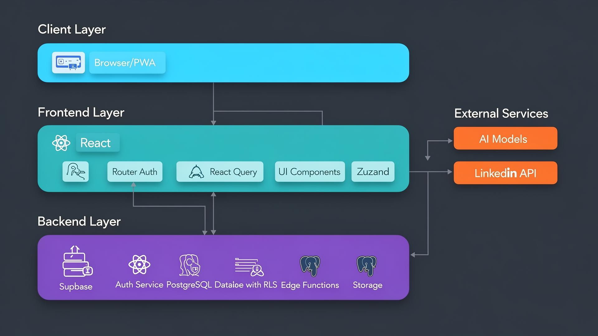
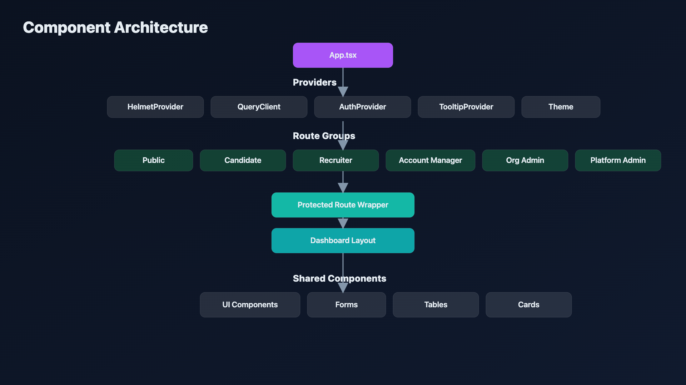
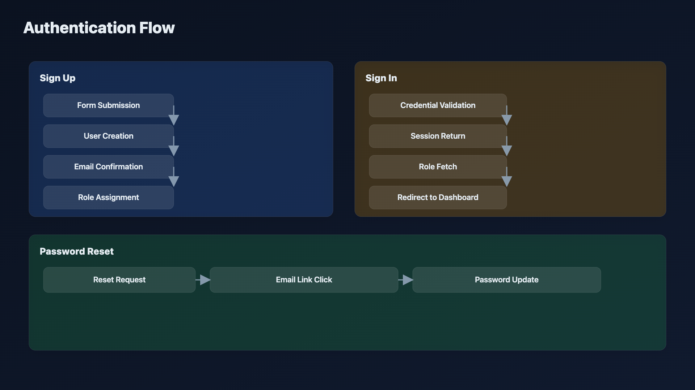
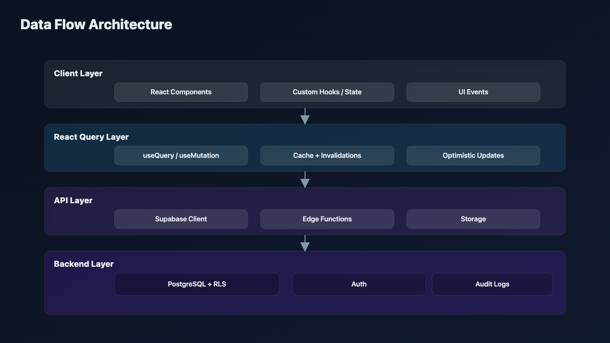
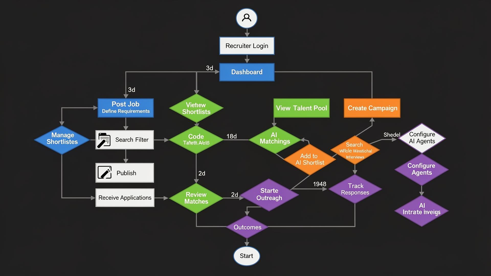
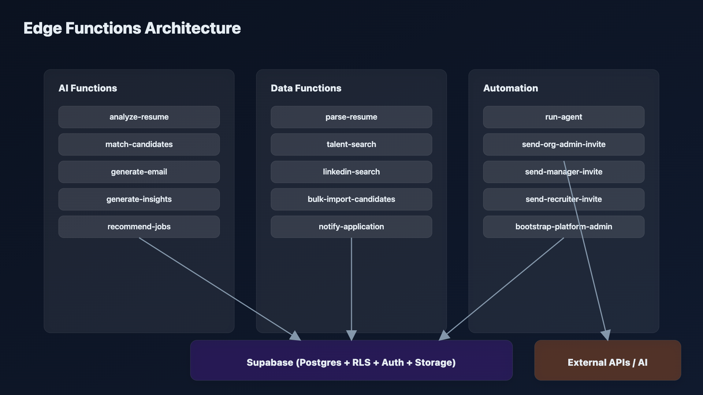

# UltraHire — AI-Powered Recruitment Platform

**UltraHire** (formerly TalentMatch AI) is a modern, full-stack recruitment platform that connects candidates with recruiters using AI-powered matching, resume analysis, and talent insights.


## 📋 Table of Contents

- [Overview](#overview)
- [Architecture](#architecture)
- [Features](#features)
- [Tech Stack](#tech-stack)
- [Prerequisites](#prerequisites)
- [Getting Started](#getting-started)
- [Environment Variables](#environment-variables)
- [Project Structure](#project-structure)
- [User Roles](#user-roles)
- [Database Schema](#database-schema)
- [Security Features](#security-features)
- [Testing Guide](#testing-guide)
- [Edge Functions](#edge-functions)
- [Deployment](#deployment)
- [Documentation](#documentation)
- [Contributing](#contributing)

## Overview

UltraHire is a comprehensive recruitment solution designed to streamline the hiring process for organizations of all sizes. The platform leverages AI to match candidates with job opportunities, analyze resumes, and provide actionable talent insights.

### Key Capabilities

- **For Candidates**: Job search, application tracking, resume management, AI-powered career analysis, resume workspace (tailor to job), engagement request flows
- **For Recruiters**: Talent pool management, AI matching, outreach campaigns, shortlists, pipelines (applications + engagements), talent sourcing, marketplace profiles
- **For Account Managers**: Team oversight, recruiter assignments, analytics, client management, audit logs; can switch to Recruiter role when they have both
- **For Org Admins**: Invite account managers, recruiters, and **candidates** by email; manage users and audit logs; profile editing (name, phone); candidate linking
- **For Platform Admins**: Tenant provisioning, org admin lifecycle, audit visibility

## Architecture

### System Architecture



*Three-tier architecture: Client (Browser/PWA) → Frontend (React + Vite with React Router, Auth, React Query, shadcn/ui, Zustand) → Backend (Supabase with Auth Service, PostgreSQL + RLS, Edge Functions, Storage) + External Services (AI Models, LinkedIn API)*

### Component Architecture



*Hierarchical component structure: App.tsx → Providers (Helmet, QueryClient, Auth, Tooltip, Theme) → Route Groups (Public, Candidate, Recruiter, Manager) → Protected Route Wrapper → Dashboard Layout → Shared Components*

### Authentication Flow



*Three authentication flows: Sign Up (form → create user → trigger profile creation → assign role → redirect), Sign In (validate credentials → return session → fetch roles → redirect), Password Reset (request → email → link click → update)*

### Data Flow Architecture



*Horizontal data flow: Client Layer (React Components, Custom Hooks, Zustand Store) → React Query Layer (useQuery, useMutation, Cache) → API Layer (Supabase Client, Edge Functions) → Backend Layer (Database + RLS, Edge Functions, Storage)*

### Database Entity Relationship Diagram


*Central ORGANIZATIONS entity connecting to: USER_ROLES, PROFILES, JOBS, CANDIDATE_PROFILES, APPLICATIONS, RESUMES, CANDIDATE_SHORTLISTS, AI_RECRUITING_AGENTS, OUTREACH_CAMPAIGNS, and more*

### Recruiter Workflow



*Complete recruiter journey: Login → Dashboard → (Post Job | View Talent Pool | Manage Shortlists | Configure AI Agents) → AI Matching → Review → Outreach → Track Responses → Schedule Interviews*

### Edge Function Architecture



*Deno-based edge functions: AI Functions (analyze-resume, match-candidates, generate-email, generate-insights, recommend-jobs) + Data Functions (parse-resume, bulk-import, talent-search, linkedin-search) + Automation (run-agent) → External Services (AI Models, LinkedIn API) + Supabase Database*


## Features

### Candidate Features
- 🔍 **Job Search** - Browse and filter job listings
- 📄 **Resume Management** - Upload and manage multiple resumes
- 🤖 **AI Analysis** - Get AI-powered feedback on your resume
- 📊 **Application Tracking** - Monitor application status in real-time
- 👤 **Profile Management** - Comprehensive profile with skills, experience, education
- 🔔 **Job Alerts** - Get notified when matching jobs are posted
- 💬 **Rejection Feedback** - Understand why applications weren't selected

### Recruiter Features
- 👥 **Talent Pool** - Centralized candidate database with filtering
- 🎯 **AI Matching** - Intelligent candidate-job matching algorithms
- 📧 **Outreach Campaigns** - Automated email sequences
- 📋 **Shortlists** - Create and manage candidate shortlists
- 🔎 **Talent Search** - Advanced search with multiple criteria
- 🤖 **AI Agents** - Automated recruiting assistants
- 📈 **Talent Insights** - Data-driven hiring analytics
- 📅 **Interview Scheduling** - Calendar-based interview management
- ✉️ **Email Templates** - Reusable email templates
- 📊 **Pipeline View** - Kanban-style candidate tracking

### Account Manager Features
- 📊 **Analytics Dashboard** - Organization-wide metrics
- 👥 **Team Management** - Manage recruiters and permissions
- 🏢 **Organization Settings** - Configure company profile
- 📋 **Job Oversight** - Monitor all job postings
- 🏭 **Client Management** - Manage client companies and requirements
- 📜 **Audit Logs** - Track all system activity and changes

## Tech Stack

### Frontend
- **React 18** - UI library
- **TypeScript** - Type safety
- **Vite** - Build tool and dev server
- **Tailwind CSS** - Utility-first styling
- **shadcn/ui** - Component library
- **React Router v6** - Client-side routing
- **React Query (TanStack Query)** - Server state management
- **React Hook Form** - Form handling
- **Zod** - Schema validation
- **Recharts** - Data visualization
- **Lucide React** - Icon library
- **Framer Motion** - Animations (via Tailwind)

### Backend
- **Supabase** - Backend-as-a-Service
  - PostgreSQL database
  - Row Level Security (RLS)
  - Edge Functions (Deno)
  - Authentication
  - Real-time subscriptions
  - File storage

### AI Integration
- Resume parsing and analysis
- Candidate-job matching
- Email generation
- Talent insights generation

## Prerequisites

Before you begin, ensure you have the following installed:

- **Node.js** (v18.18.0+; v20+ recommended) - [Download](https://nodejs.org/)
- **npm** (v9.0.0 or higher) - Comes with Node.js
- **Git** - [Download](https://git-scm.com/)
- **Supabase CLI** (for database setup) - [Install Guide](https://supabase.com/docs/guides/cli)

To verify your installations:

```bash
node --version      # Should be v18.x.x or higher
npm --version       # Should be v9.x.x or higher
git --version       # Any recent version
supabase --version  # Should be v1.x.x or higher
```

### Installing Supabase CLI

**macOS (Homebrew):**
```bash
brew install supabase/tap/supabase
```

**Windows (Scoop):**
```bash
scoop bucket add supabase https://github.com/supabase/scoop-bucket.git
scoop install supabase
```

**Linux/WSL:**
```bash
curl -fsSL https://raw.githubusercontent.com/supabase/cli/main/install.sh | sh
```

**npm (all platforms):**
```bash
npm install -g supabase
```

## Getting Started

This repo supports **Supabase local for development** and **Supabase cloud for production**.

### Quickstart (fresh laptop)

```bash
git clone https://github.com/yeluru/talentmatch-ai.git
cd talentmatch-ai

npm install

# Optional (mainly for production/cloud; local dev forces local Supabase when on localhost)
cp env.example .env

# Start Supabase (DB + Auth + Studio + Mailpit)
supabase start

# First-time local DB setup (applies migrations)
supabase db reset

# Serve edge functions locally (in a second terminal)
supabase functions serve

# Run frontend (in a third terminal)
npm run dev
```

Then open:
- App: `http://localhost:8080`
- Supabase Studio: `http://127.0.0.1:54323`
- Mailpit (local email inbox): run `supabase status` and open the **Mailpit** URL it prints

### Local development (recommended)

#### 1) Prereqs
- Node.js **v18.18+** (v20+ recommended)
- Docker Desktop
- Supabase CLI

#### 2) Install dependencies

```bash
npm install
```

#### 3) Start Supabase local (DB + Auth + Studio + Mailpit)

```bash
supabase start
supabase db reset
```

Useful URLs (local defaults):
- Supabase API: `http://127.0.0.1:54321`
- Supabase Studio: `http://127.0.0.1:54323`
- Mailpit (local email inbox): run `supabase status` and open the **Mailpit** URL it prints

### Marketplace model (jobs + candidates)

- **Jobs**:
  - Default: **Private (tenant-only)**.
  - Optional: **Public** (discoverable to all signed-in candidates).
  - Public job pages render only **public** jobs.
- **Candidates**:
  - Default: not discoverable to other tenants.
  - Optional: discoverable opt-in during signup (“Allow employers to discover my profile”).
- **Recruiter-side terminology**:
  - **Profiles**: browseable people records (tenant pool + opted-in marketplace).
  - **Engagements**: tenant-scoped workflow stages (rate → RTR → screening → submission → onboarding).

#### 4) Serve Edge Functions locally

```bash
supabase functions serve
```

#### 5) Run the frontend

```bash
npm run dev
```

App runs at `http://localhost:8080`.
#### Applying DB changes locally (without wiping data)
When you add new migration files under `supabase/migrations/`, apply them to your local DB with:

```bash
supabase migration up
```

Use `supabase db reset` when you want a clean slate (it deletes local data). For a brand-new laptop/DB, `db reset` is the simplest way to apply all migrations.


> Note: when running on localhost, the frontend is intentionally “pinned” to local Supabase to prevent accidental cloud usage.

### Production (Supabase cloud + Render frontend)

High-level: create a Supabase project, push migrations, deploy functions, then deploy the frontend to Render.

#### 1) Create Supabase cloud project
- Create a project in Supabase Cloud
- In Supabase Dashboard:
  - **Auth → URL Configuration**: set Site URL + Redirect URLs to your Render URL (once known)
  - **Auth → Providers → Email**: keep **email confirmations enabled**
  - Configure SMTP (recommended) so confirmation emails are reliable in production

#### 2) Push database migrations

```bash
supabase login
supabase link --project-ref YOUR_PROJECT_REF
supabase db push
```

#### 3) Deploy Edge Functions + secrets

```bash
supabase functions deploy
supabase secrets set OPENAI_API_KEY=...
supabase secrets set RESEND_API_KEY=...        # production email sender
supabase secrets set PUBLIC_APP_URL=...        # your Render URL
```

#### 4) Deploy frontend to Render (Static Site)
- Build command: `npm ci && npm run build`
- Publish directory: `dist`
- Add environment variables in Render:
  - `VITE_SUPABASE_URL`
  - `VITE_SUPABASE_PUBLISHABLE_KEY`
  - `VITE_SUPABASE_PROJECT_ID`
  - (any other `VITE_*` variables your UI needs)

Also configure Render SPA routing (rewrite all paths to `/index.html`).

#### Platform Admin bootstrap (production + local)
Platform Admin is the internal role `super_admin`.

To designate **any email** as a Platform Admin without hardcoding:
1. In Supabase Studio, add a row to `public.platform_admin_allowlist` with the admin email.
2. Create that user in **Authentication** (or have them sign up if appropriate).
3. On user creation, the `handle_new_user()` trigger will automatically assign `super_admin`.

If a user already exists and has no role, the app will attempt a safe bootstrap on sign-in via the
`bootstrap-platform-admin` edge function (allowlist-based).

## Database Migrations

The project includes **70+** database migrations in `supabase/migrations/`. They set up core tables, RLS, and features. Key additions in recent releases:

### Core Tables (examples)
- `organizations`, `profiles` (with `first_name`, `last_name`), `user_roles`, `jobs`, `applications`
- `candidate_profiles`, `candidate_skills`, `candidate_experience`, `candidate_education`, `resumes`
- `candidate_shortlists`, `shortlist_candidates`, `outreach_campaigns`, `campaign_recipients`
- `candidate_invites` — Org Admin email invites for candidates; `accept_candidate_invite` RPC links invitee to org
- `account_manager_recruiter_assignments` — Assign recruiters to account managers
- Engagement workflow tables, notifications, invite codes, audit logging, etc.

### Database Functions (examples)
- `has_role()`, `get_user_organization()`, `assign_user_role()`, `recruiter_can_access_candidate()`
- `update_own_profile()` — Profile editing (first name, last name, phone) for admins/candidates
- `accept_candidate_invite()` — Link invited user to org as candidate on signup/sign-in
- `generate_invite_code()`, `use_invite_code()`, `handle_new_user()`, `update_updated_at_column()`

### Verifying Migration Success

After running migrations, verify in Supabase Dashboard:

1. **Tables**: Table Editor — e.g. `candidate_invites`, `profiles` (with `first_name`, `last_name`), core tables
2. **Functions**: Database → Functions — e.g. `update_own_profile`, `accept_candidate_invite`, `has_role`, etc.
3. **Policies**: RLS enabled on tables with role/org-scoped policies

Or via CLI: `supabase db diff`, `supabase migration list`

---

## Build Commands

| Command | Description |
|---------|-------------|
| `npm run dev` | Start development server (port 8080) |
| `npm run build` | Build for production |
| `npm run preview` | Preview production build locally |
| `npm run lint` | Run ESLint |

## Environment Variables

### Frontend env (`.env`)
This repo uses Vite env vars. **Never commit `.env`** (it is ignored).

- **Local dev**: when running on `localhost`, the app forces local Supabase (`http://127.0.0.1:54321`) regardless of env vars.
- **Production / non-localhost previews**: copy `env.example` to `.env` and fill:
  - `VITE_SUPABASE_URL`
  - `VITE_SUPABASE_PUBLISHABLE_KEY`
  - `VITE_SUPABASE_PROJECT_ID`

```bash
cp env.example .env
```

| Variable | Description | Required |
|----------|-------------|----------|
| `VITE_SUPABASE_URL` | Supabase project URL | Yes |
| `VITE_SUPABASE_PUBLISHABLE_KEY` | Supabase anon/public key | Yes |
| `VITE_SUPABASE_PROJECT_ID` | Supabase project ID | Yes |

> **Note**: The `VITE_` prefix is required for Vite to expose these variables to the client-side code.

## Project Structure

```
├── public/                  # Static assets (favicon, og-image, robots.txt, etc.)
├── src/
│   ├── components/
│   │   ├── admin/           # Admin shared (e.g. AdminProfileForm)
│   │   ├── layouts/         # DashboardLayout, AdminShell, OrgAdminLayout, SuperAdminLayout
│   │   ├── recruiter/       # Recruiter-specific (CategoryLanding, etc.)
│   │   ├── candidate/       # Candidate-specific components
│   │   └── ui/              # shadcn/ui components
│   ├── hooks/               # useAuth, use-mobile, use-toast, useTableSort, etc.
│   ├── integrations/supabase/
│   ├── lib/                 # orgSlug, utils, org, permissions, storagePaths, statusOptions, etc.
│   ├── pages/
│   │   ├── admin/           # SuperAdminDashboard, AdminProfilePage
│   │   ├── orgAdmin/        # OrgAdminDashboard, OrgAdminProfilePage, OrgAdminUsers, etc.
│   │   ├── candidate/       # Dashboard, profile, resumes, job search, applications, etc.
│   │   ├── manager/         # Account manager: dashboard, team, jobs, analytics, audit logs
│   │   ├── public/          # Landings, PublicJobPage
│   │   └── recruiter/       # Jobs, talent pool, pipelines, shortlists, etc.
│   ├── stores/
│   ├── App.tsx
│   ├── index.css
│   └── main.tsx
├── supabase/
│   ├── config.toml
│   ├── functions/           # 35+ edge functions (invites, AI, talent search, etc.)
│   └── migrations/         # 70+ SQL migrations
├── docs/                    # PRE-PROD-CHECKLIST, PRODUCTION-DEPLOYMENT, PAGE-WIDTH-AUDIT, etc.
├── env.example
├── package.json
├── tailwind.config.ts
├── tsconfig.json
└── vite.config.ts
```

## User Roles

The platform supports **five** roles (see `docs/RBAC-for-Product.txt` for the product-friendly breakdown):

### 1. Candidate (`candidate`) — **only role that can self-sign up**
- Can search and apply for jobs
- Manage personal profile and resumes
- Track application status
- Access AI-powered career analysis

### 2. Recruiter (`recruiter`) — invite-only
- Manage talent pool for their organization
- Create and manage job postings
- Run AI matching and outreach campaigns
- Create candidate shortlists
- Access talent insights

### 3. Account Manager (`account_manager`) — invite-only
- Invites/removes recruiters in their org; can be assigned to specific recruiters (`account_manager_recruiter_assignments`)
- Org-level oversight: team, jobs, analytics, clients, audit logs
- Can **switch to Recruiter** role when they have both (e.g. to do hands-on recruiting)

### 4. Org Admin (`org_admin`) — invite-only
- Manages account managers and recruiters inside their organization
- **Invites candidates by email** (invite link → signup → user linked to org as candidate)
- Can link/unlink candidates to the org and add internal notes/status
- Profile page to edit first name, last name, and phone

### 5. Platform Admin (`super_admin`) — internal ops
- Read-only across the platform **except** Org Admin lifecycle (invite/revoke) and tenant provisioning tools
- Profile page for name and contact details

## Database Schema

### Core Tables

| Table | Description |
|-------|-------------|
| `profiles` | User profile information |
| `organizations` | Company/organization data |
| `user_roles` | User role assignments |
| `jobs` | Job postings |
| `applications` | Job applications |
| `candidate_profiles` | Extended candidate information |
| `candidate_skills` | Candidate skills |
| `candidate_experience` | Work experience |
| `candidate_education` | Education history |
| `resumes` | Uploaded resumes |
| `candidate_shortlists` | Recruiter shortlists |
| `shortlist_candidates` | Candidates in shortlists |
| `outreach_campaigns` | Email campaigns |
| `campaign_recipients` | Campaign recipients |
| `ai_recruiting_agents` | AI agent configurations |
| `agent_recommendations` | AI recommendations |
| `ai_resume_analyses` | Resume analysis results |
| `talent_insights` | Generated insights |
| `notifications` | User notifications |
| `organization_invite_codes` | Invite codes |
| `candidate_invites` | Org Admin candidate email invites |
| `email_sequences` | Email templates |

## Security Features

### Row Level Security (RLS)

All tables are protected with Row Level Security policies:

1. **Organization Isolation** - Recruiters can only access candidates within their organization
2. **User Data Protection** - Users can only read/modify their own data
3. **Role-Based Access** - Different access levels based on user roles

### Authentication

- Email/password authentication via Supabase Auth
- Email confirmations are enabled (local uses Mailpit; prod should use SMTP like Resend)
- Password reset flow implemented
- Secure session management

### Key Security Policies

- Candidates can only self-assign the `candidate` role
- Recruiter/manager roles must be assigned via secure RPC function
- Cross-organization data access is prevented
- All sensitive operations require authentication

## Testing Guide

### 1. Authentication Testing

**Sign Up as Candidate:**
1. Go to `/auth`
2. Click "Sign Up" tab
3. Fill in details
4. Confirm email (Mailpit locally), then sign in
5. Verify redirect to candidate dashboard

**Staff onboarding (invite-only):**
- Platform Admin invites Org Admin (tenant provisioning)
- Org Admin invites Account Manager or Recruiter (or **Candidate** — invite link → signup → user linked to org as candidate)
- Org Admin / Account Manager invites Recruiter
- Invited user uses invite link → signs up → confirms email → signs in → invite is claimed and dashboard opens

**Password Reset:**
1. Go to `/auth`
2. Click "Forgot password?"
3. Enter email
4. Check for confirmation message

### 2. Candidate Features Testing

- **Profile**: Navigate to Profile page, update information
- **Resume Upload**: Upload a PDF or DOCX resume (legacy `.doc` is not supported)
- **Job Search**: Browse available jobs
- **Apply**: Submit application to a job
- **AI Analysis**: Check AI-powered resume feedback (keyword coverage + model score)
- **Resume Workspace**: Tailor resume to a JD, export premium PDF/DOCX

### 3. Recruiter Features Testing

- **Talent Pool**: View candidates in your organization
- **Create Job**: Post a new job listing
- **AI Matching**: Run AI matching for a job
- **Shortlists**: Create and manage candidate lists
- **Outreach**: Set up email campaigns

### 4. Security Testing

**Organization Isolation:**
1. Create two recruiter accounts in different organizations
2. Add candidates to each organization
3. Verify Recruiter A cannot see Recruiter B's candidates

**Role Protection:**
1. Attempt to sign up as recruiter without organization
2. Verify it fails or defaults to candidate

## Edge Functions

The platform includes **35+** Supabase Edge Functions in `supabase/functions/`. Key ones:

| Function | Purpose |
|----------|---------|
| **Invites & auth** | |
| `send-candidate-invite` | Org Admin invites candidates by email (invite link) |
| `send-recruiter-invite`, `send-manager-invite`, `send-org-admin-invite` | Invite staff by email |
| `get-invite-details` | Resolve invite token (org_admin, manager, recruiter, candidate) |
| `send-engagement-email` | Send engagement emails (e.g. "Review & respond") |
| **AI & matching** | |
| `analyze-resume` | AI resume analysis (keyword coverage + model score) |
| `match-candidates` | AI candidate-job matching |
| `parse-resume`, `parse-job-description` | Text extraction (PDF/DOCX) |
| `tailor-resume` | ATS-optimized resume tailoring |
| `generate-email`, `generate-insights`, `recommend-jobs` | AI generation and recommendations |
| `run-agent` | Execute AI agents |
| **Talent & sourcing** | |
| `bulk-import-candidates`, `talent-search` | Bulk import and talent search |
| `linkedin-search`, `fetch-linkedin-text`, `enrich-linkedin-profile` | LinkedIn integration |
| `google-search-linkedin`, `serpapi-search-linkedin`, `web-search` | Sourcing search |
| **Other** | `notify-application`, `bootstrap-platform-admin`, super-admin helpers |

For production deployment and secrets, see [docs/PRODUCTION-DEPLOYMENT.md](docs/PRODUCTION-DEPLOYMENT.md) and [docs/PRE-PROD-CHECKLIST.md](docs/PRE-PROD-CHECKLIST.md).

## Deployment

**Recommended for production:** Supabase (backend) + **Render** (frontend static site). See **[docs/PRODUCTION-DEPLOYMENT.md](docs/PRODUCTION-DEPLOYMENT.md)** for the full guide (migrations, Edge Functions, secrets, Render env vars, SPA routing). Use **[docs/PRE-PROD-CHECKLIST.md](docs/PRE-PROD-CHECKLIST.md)** when shipping a new release.

### Option 1: Render (recommended)

- Create a **Static Site** on Render; connect your repo.
- Build: `npm run build` (or `npm ci && npm run build`); Publish: `dist`.
- Set `VITE_SUPABASE_URL`, `VITE_SUPABASE_PUBLISHABLE_KEY` (and optional `VITE_SUPABASE_PROJECT_ID`).
- Add a **rewrite** rule: `/*` → `/index.html` (status 200) for SPA routing.

### Option 2: Vercel Deployment

```bash
# Install Vercel CLI
npm install -g vercel

# Deploy
vercel

# Follow prompts to link/create project
# Set environment variables in Vercel dashboard
```

**Environment Variables to set in Vercel:**
- `VITE_SUPABASE_URL`
- `VITE_SUPABASE_PUBLISHABLE_KEY`
- `VITE_SUPABASE_PROJECT_ID`

### Option 3: Netlify Deployment

```bash
# Install Netlify CLI
npm install -g netlify-cli

# Build the project
npm run build

# Deploy
netlify deploy --prod --dir=dist
```

**netlify.toml** (create in project root):
```toml
[build]
  command = "npm run build"
  publish = "dist"

[[redirects]]
  from = "/*"
  to = "/index.html"
  status = 200
```

### Option 4: Docker Deployment

**Dockerfile** (create in project root):
```dockerfile
# Build stage
FROM node:18-alpine AS builder
WORKDIR /app
COPY package*.json ./
RUN npm ci
COPY . .
RUN npm run build

# Production stage
FROM nginx:alpine
COPY --from=builder /app/dist /usr/share/nginx/html
COPY nginx.conf /etc/nginx/nginx.conf
EXPOSE 80
CMD ["nginx", "-g", "daemon off;"]
```

**nginx.conf** (create in project root):
```nginx
events {
    worker_connections 1024;
}

http {
    include /etc/nginx/mime.types;
    default_type application/octet-stream;

    server {
        listen 80;
        server_name localhost;
        root /usr/share/nginx/html;
        index index.html;

        location / {
            try_files $uri $uri/ /index.html;
        }
    }
}
```

**Build and run:**
```bash
docker build -t talentmatch-ai .
docker run -p 80:80 talentmatch-ai
```

### Option 5: AWS S3 + CloudFront

```bash
# Build
npm run build

# Sync to S3
aws s3 sync dist/ s3://your-bucket-name --delete

# Invalidate CloudFront cache (if using)
aws cloudfront create-invalidation --distribution-id YOUR_DIST_ID --paths "/*"
```

## Available Scripts

| Script | Description |
|--------|-------------|
| `npm run dev` | Start development server (port 8080) |
| `npm run build` | Build for production |
| `npm run preview` | Preview production build |
| `npm run lint` | Run ESLint |

## Supabase CLI Commands Reference

| Command | Description |
|---------|-------------|
| `supabase login` | Authenticate with Supabase |
| `supabase link --project-ref ID` | Link to existing project |
| `supabase db push` | Apply all migrations |
| `supabase migration up` | Apply new migrations to local DB (non-destructive) |
| `supabase db diff` | Show schema differences |
| `supabase migration list` | List all migrations |
| `supabase functions deploy` | Deploy all edge functions |
| `supabase functions deploy NAME` | Deploy specific function |
| `supabase secrets set KEY=VALUE` | Set edge function secret |
| `supabase secrets list` | List all secrets |

## Documentation

| Doc | Description |
|-----|--------------|
| [docs/PRODUCTION-DEPLOYMENT.md](docs/PRODUCTION-DEPLOYMENT.md) | Production deploy (Supabase + Render, migrations, Edge Functions, secrets) |
| [docs/PRE-PROD-CHECKLIST.md](docs/PRE-PROD-CHECKLIST.md) | Pre-release checklist (migrations, functions, verification) |
| [docs/PAGE-WIDTH-AUDIT.md](docs/PAGE-WIDTH-AUDIT.md) | Page width standards and route audit |
| [docs/RBAC-for-Product.txt](docs/RBAC-for-Product.txt) | Role-based access (product view) |
| [LOCAL-DEV.md](LOCAL-DEV.md) | Local development notes |

## Contributing

1. Fork the repository
2. Create a feature branch: `git checkout -b feature/my-feature`
3. Commit changes: `git commit -m 'Add my feature'`
4. Push to branch: `git push origin feature/my-feature`
5. Open a Pull Request

### Code Style

- Use TypeScript for all new files
- Follow existing component patterns
- Use Tailwind CSS for styling
- Prefer shadcn/ui components
- Write meaningful commit messages

## Troubleshooting

### Common Issues

**"Cannot connect to database"**
- If using **Supabase cloud**: verify `.env` has correct `VITE_SUPABASE_*` values
- If using **local**: run `supabase status` and ensure local services are running

**"Cannot find project ref. Have you run supabase link?"**
- This happens when you run cloud commands (like `supabase db push`) without linking.
- For local development you usually **do not** need `supabase link`. Use:
  - `supabase start`
  - `supabase db reset` (first-time) or `supabase migration up` (new migrations)

**"Unauthorized" errors**
- Clear browser storage and re-login
- Verify RLS policies are correctly applied
- Check that user has correct role assigned

**"Edge function not found"**
- Deploy functions: `supabase functions deploy`
- Check function name matches exactly
- Verify function is in `supabase/functions/` directory

**"Migration failed"**
- Check for existing conflicting tables
- Run `supabase db reset` to start fresh (WARNING: deletes all data)
- Review migration SQL for errors

**Build failures**
- Delete `node_modules` and reinstall: `rm -rf node_modules && npm install`
- Clear Vite cache: `rm -rf node_modules/.vite`
- Check for TypeScript errors: `npx tsc --noEmit`

**Resume upload fails**
- Verify `resumes` storage bucket exists
- Check bucket is set to public
- Verify file size is under limit

### Debug Mode

Enable detailed logging by opening browser DevTools:
- **Console tab**: View application logs
- **Network tab**: Monitor API requests
- **Application tab**: Check localStorage/sessionStorage

## License

This project is proprietary software.

## Support

For questions or issues, please open a GitHub issue or contact the development team.

---

Built with ❤️ using [Lovable](https://lovable.dev)
